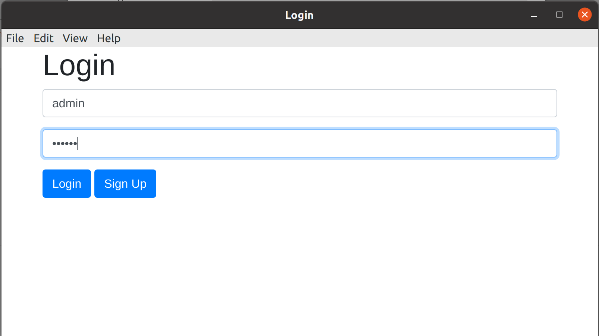

## Authorization Code Flow
[RFC reference](https://tools.ietf.org/html/rfc6749#section-1.3.1)


1. User initializes authentication and authorization flow.
2. Client sends request.
3. Request is verified by IAM-service.
4. IAM-service responds, providing login context.
5. User enters login credentials and confirms scope (consent)
6. Client sends login context and user's credentials ti IAM-service.
7. IAM-service has now complete authentication and authorization request, claims and after verification, issues authorization code.
8. Client received authorization code.
9. Client sends back authorization code.
10. IAM-service checks authorization code.
11. Tokens are issues after authorization code verification.
12. Client confirms successful login to User.
13. User may access data using access_token issued in #11.    

### Test in Postman

* __Grant Type__ : Authorization Code
* __Callback URL__: ```/services/authentication/iam-admins/iam-admins/token```
* __Auth URL__: ```http://localhost:8080/services/authentication/iam-admins/iam-admins/authorize```
* __Access Token URL__ : ```http://localhost:8080/services/authentication/iam-admins/iam-admins/token```
* __Client ID__: admin-client
* __Scope__: ""
* __State__: <random-string>

 
 
 

### Test in Insomnia
 
 
 